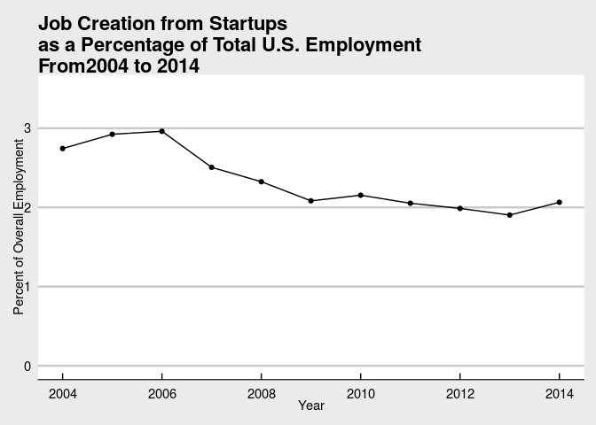

[](https://doi.org/10.5281/zenodo.400356)


The goal of this project is to demonstrate the feasibility of creating replicable blog posts for national statistical agencies. We pick a single blog post from the United States Census Bureau, but the general principle could be applied to many countries' national statistical agencies.

# Source document
A blog post [by Jim Lawrence, U.S. Census Bureau](http://researchmatters.blogs.census.gov/2016/12/01/how-much-do-startups-impact-employment-growth-in-the-u-s/) [-@lawrence2016] ([archived version](https://web.archive.org/web/20161229210623/http://researchmatters.blogs.census.gov/2016/12/01/how-much-do-startups-impact-employment-growth-in-the-u-s/),  [locally archived version](archive/index.html)).

# Source data
Data to produce a graph like this can be found at https://www.census.gov/ces/dataproducts/bds/data_firm.html. Users can look at the economy-wide data by age of the firm, where startups are firms with zero age:


# Getting and manipulating the data
We will illustrate how to generate Figure 1 using R -@2019language. Users wishing to use Javascript, SAS, or Excel, or Python, can achieve the same goal using the tool of their choice. Note that we will use the full CSV file at http://www2.census.gov/ces/bds/firm/bds_f_age_release.csv, but users might also want to consult the [BDS API](https://www.census.gov/data/developers/data-sets/business-dynamics.html).


```r
bdsbase <- "http://www2.census.gov/ces/bds/"
type <- "f_age"
ltype <- "firm"
# for economy-wide data
ewtype <- "f_all"
fafile <- paste("bds_",type,"_release.csv",sep="")
ewfile <- paste("bds_",ewtype,"_release.csv",sep="")
# this changes whether we read live data or Zenodo data
bds.from.source <- FALSE
```

We are going to read in two files: the economy wide file bds_f_all_release.csv, and the by-firm-age file bds_f_age_release.csv. If `bds.from.source` is `TRUE`, we read the most current file from the Census Bureau website. If `bds.from.source` is `FALSE`, we read from Zenodo, at DOI **10.5072/zenodo.664408**. In this run, `bds.from.source` is **FALSE**.

```r
# we need the particular type 
if ( bds.from.source ) {
  conr <- gzcon(url(paste(bdsbase,ltype,fafile,sep="/")))
  txt <- readLines(conr)
  bdstype <- read.csv(textConnection(txt))
  # the ew file
  ewcon <- gzcon(url(paste(bdsbase,ltype,ewfile,sep="/")))
  ewtxt <- readLines(ewcon)
  bdsew <- read.csv(textConnection(ewtxt))
} else {
  # if not, we read the special file to read it from Zenodo
  source("01_download_replication_data.R",echo=TRUE)
  bdstype <- read.csv(file.path(dataloc,fafile))
  bdsew <- read.csv(file.path(dataloc,ewfile))
}
```

```
## 
## > library(dplyr)
## 
## > library(rjson)
## 
## > library(tidyr)
## 
## > basepath <- file.path(getwd())
## 
## > dataloc <- file.path(basepath, "data")
## 
## > for (dir in list(dataloc)) {
## +     if (file.exists(dir)) {
## +     }
## +     else {
## +         dir.create(file.path(dir))
## +     }
## + }
## 
## > zenodo.prefix <- "10.5072/zenodo"
## 
## > zenodo.id <- "664408"
## 
## > zenodo.api = "https://sandbox.zenodo.org/api/records/"
## 
## > download.file(paste0(zenodo.api, zenodo.id), destfile = file.path(dataloc, 
## +     "metadata.json"))
## 
## > latest <- fromJSON(file = file.path(dataloc, "metadata.json"))
## 
## > print(paste0("DOI: ", latest$links$doi))
## [1] "DOI: https://doi.org/10.5072/zenodo.664408"
## 
## > print(paste0("Current: ", latest$links$html))
## [1] "Current: https://sandbox.zenodo.org/record/664408"
## 
## > print(paste0("Latest: ", latest$links$latest_html))
## [1] "Latest: https://sandbox.zenodo.org/record/664408"
## 
## > file.list <- as.data.frame(latest$files) %>% select(starts_with("self")) %>% 
## +     gather()
## 
## > for (value in file.list$value) {
## +     print(value)
## +     if (grepl("csv", value)) {
## +         print("Downloading...")
## +         file.name <- basena .... [TRUNCATED] 
## [1] "https://sandbox.zenodo.org/api/files/beb18dc0-982d-428f-b021-b7793ce8d79b/bds_f_age_release.csv"
## [1] "Downloading..."
## [1] "https://sandbox.zenodo.org/api/files/beb18dc0-982d-428f-b021-b7793ce8d79b/bds_f_all_release.csv"
## [1] "Downloading..."
```


We're going to now compute the fraction of total U.S. employment (`Emp`) that is accounted for by job creation from startups (`Job_Creation if fage4="a) 0"`):


```r
analysis <- bdsew[,c("year2","emp")]
analysis <- merge(x = analysis, y=subset(bdstype,fage4=="a) 0")[,c("year2","Job_Creation")], by="year2")
analysis$JCR_startups <- analysis$Job_Creation * 100 / analysis$emp
# properly name everything
names(analysis) <- c("Year","Employment","Job Creation by Startups", "Job Creation Rate by Startups")
```

# Create Figure 1

Now we simply plot this for the time period 2004-2014:
<!-- -->

## Compare to original image:


# References
